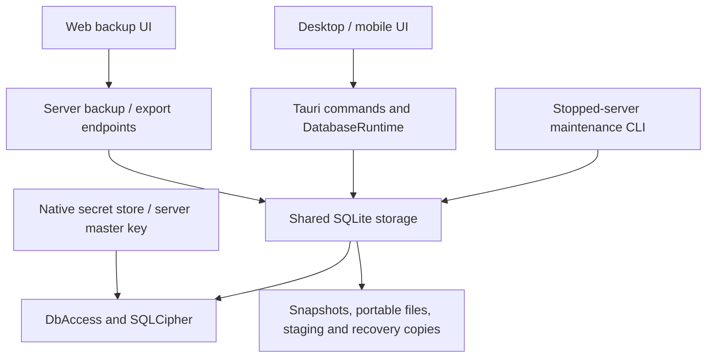

# Database encryption and backups

Wealthfolio uses SQLCipher for optional database encryption and
password-protected portable backups. Encryption at rest, saved snapshots and
portable exports are separate concerns. Restore preserves the destination's
encryption policy rather than adopting the source's key or setting.

This document describes the implemented architecture. See the
[operator guide](../self-host/backups.md) for backup and restore procedures,
[server encryption configuration](../self-host/README.md#database-encryption-optional)
for deployment commands, and [credential storage](credential-storage.md) for
platform secret-store details.

## Components and boundaries

Business repositories continue to use Diesel and the write actor. `DbAccess`
contains the database path and optional installation key, and applies that key
before queries on Diesel and rusqlite connections. Both libraries use the same
SQLCipher-enabled `libsqlite3-sys`. A connection without a key opens ordinary
plaintext SQLite; encryption does not require a separate application build.

The native runtime can stop and rebuild its database services for maintenance.
The server retains one application state per profile, shared by browsers using
that profile. See [profile architecture](multi-profile-and-app-lock.md) for
runtime selection and access grants. Server restore and encryption conversion
are offline commands; there is no dynamic server runtime replacement, web
restore upload, maintenance polling or recovery API.

## Keys and encryption policy

| Secret                   | Source and use                                                                                                                                     | Recovery implications                                                                                                 |
| ------------------------ | -------------------------------------------------------------------------------------------------------------------------------------------------- | --------------------------------------------------------------------------------------------------------------------- |
| Native database key      | Random 32-byte key stored through the OS credential backend as `database_encryption_key`                                                           | Keep the key after disabling encryption so older encrypted snapshots remain readable.                                 |
| Server database key      | HKDF-SHA256 from the operator master secret; legacy `wealthfolio-db` derivation is retained, new profiles use a versioned profile-specific context | Preserve the master secret separately from data backups. Database, vault and authentication derivations are distinct. |
| Portable backup password | User-chosen password, processed by the portable SQLCipher profile                                                                                  | Unlocks that export without the source installation key. It is not an app login or destination database key.          |
| Staging key              | Random temporary key held by a prepared operation                                                                                                  | Protects private working copies; it is not a user recovery mechanism.                                                 |

Native key creation is separate from key lookup. Before conversion uses a newly
created key, the native provider persists it and reads it back. Startup
detection never silently generates a replacement for a missing key. A native
encryption marker records the intended policy so a missing database is not
silently treated as a plaintext installation. Keys are retained after disabling
encryption.

On the server, `WF_SECRET_KEY` and `WF_SECRET_KEY_FILE` feed the same key
loader; conflicting inputs are rejected. `WF_DB_REQUIRE_ENCRYPTION` defaults to
false. It selects encryption for a new database and enforces the policy for an
existing one. It does not convert an existing file. `db encrypt` and
`db decrypt` perform that conversion while the server is stopped. Changing the
master secret is not supported key rotation: it also affects the credential
vault and authentication.

Installation keys are already random or derived and use SQLCipher's raw-key
interface. Portable passwords use password derivation. Key buffers are zeroized
where represented by the dedicated Rust key/password types and are not logged.
Neither keys nor passwords are baked into frontend assets or container images.

## Data representations

| Representation                    | Protection                                                       | Intended use                                                                  |
| --------------------------------- | ---------------------------------------------------------------- | ----------------------------------------------------------------------------- |
| Live database                     | Plaintext or installation-key encryption                         | Normal application storage                                                    |
| Managed snapshot in `backups/`    | Encryption used when the snapshot was created                    | Local rollback and saved backups; encrypted snapshots need their original key |
| Original server snapshot download | Unchanged snapshot protection and installation-specific contents | Operator recovery with the original server key                                |
| Portable `.wfbackup`              | Separate password protection; sanitized contents                 | Transfer between installations and recovery without the source key            |
| Portable `.db`                    | Explicitly unencrypted; sanitized contents                       | Interoperability when the user deliberately accepts a readable file           |

Snapshots are standalone, consistent database copies with unique filenames.
Creation uses private staging, verification and same-filesystem publication.
Listing derives protection from the actual file and available key, rather than
from the current encryption setting. There is no separate catalogue database.
Snapshot leases prevent deletion while an operation is using the file. IDs and
paths are checked against traversal and symlink escapes.

Disabling encryption does not decrypt historical backups. Enabling encryption
does not retroactively protect old exports, filesystem snapshots or external
copies. The original-download action is distinct from portable export because it
does not sanitize installation data or assign a backup password.

Device-sync “Back up first” creates a managed snapshot on all platforms,
retaining its source encryption. Whole-database exports use the Backups
protection dialog; the general data export screen supports CSV and JSON only.
Native restore accepts validated import previews rather than a separate direct
file-replacement command.

## Migration backups

`DbAccess::run_migrations_with_backup` runs before creating the pool and writer
on native desktop/mobile, hosted startup and offline encryption conversion. It
checks database ownership and inspects schema freshness before Diesel's
pending-migration query can create its bookkeeping table. Existing application
schema requires readable migration history; valid partial histories are normal.
Diesel alone determines which embedded migrations remain pending.

An existing database with pending migrations gets one `BeforeMigration` snapshot
through the existing SQLCipher copy, integrity checks and durable publication
path. Free space is checked on the actual backup filesystem against
`page_count × page_size` plus 16 MiB. This is a backup estimate, not a
reservation or a guarantee of migration working space. Backup errors prevent
migrations; migration errors retain and identify the published snapshot. No
retention, attempt journal or rollback protocol is added. Each retry can create
another snapshot while retaining earlier copies.

The low-level runner uses `synchronous=FULL` for the migration batch and
restores `NORMAL` afterward. Existing per-migration transactions,
nontransactional `VACUUM`, analysis and best-effort checkpoint behavior are
preserved. Portable validation and reference databases use this runner directly,
so they also use `FULL` but never create automatic backups. Measure portable
validation cost before adding a separate durability mode.

Plaintext desktop/server migrations use `temp_store=FILE` so large statement
journals and `VACUUM` scratch databases can use disk instead of growing the heap
with the database. Encrypted databases retain `MEMORY`: SQLCipher does not
encrypt every transient file, so FILE could expose decrypted data. Android and
iOS also retain their existing MEMORY behavior; Android's bundled SQLite forces
it at compile time, and FILE has not been validated on iOS. Using `DEFAULT`
would not enable disk storage with this SQLCipher build. See the
[measured memory investigation](database-migration-backup-validation.md#memory-investigation-controlled-reproduction)
for the evidence and limits. This trades temporary disk I/O and space for lower
memory use; it does not bound every migration's memory or working-space needs.

Native and asynchronous hosted startup run the wrapper in a blocking worker,
retaining an `Arc<DatabaseOwner>` inside the worker through caller cancellation.
Desktop setup lets the event loop render the existing startup gate and schedules
one-time menu setup on the main thread. Owner-protected startup cleanup removes
private `.snapshot-*` staging from the explicitly supplied backup root without
removing published snapshots. Recovery capabilities remain unchanged; see the
[operator guide](../self-host/backups.md#automatic-backups-before-database-upgrades).

## Portable format and validation

Protected V1 files contain a 16-byte header, `WFOLIOBACKUP\0\0\0\x01`, followed
by a SQLCipher payload. The payload uses SQLCipher compatibility profile 4 and
256,000 password-derivation iterations. Creation time, producing app version and
profile metadata are inside the encrypted database, not exposed in the header.
Unknown container versions/profiles are rejected rather than guessed.

Passwords accept 12–1,024 Unicode characters, with a maximum of 4,096 UTF-8
bytes. The bytes are preserved exactly: no trimming or Unicode normalization.
The key input has a fixed `wealthfolio-portable-v1:` prefix so a password
resembling SQLCipher raw-key syntax cannot bypass password derivation. Passwords
are passed through explicit-length or bound APIs rather than interpolated SQL.

Export copies the selected snapshot into private encrypted working storage,
validates and sanitizes that copy, then creates a fresh password-protected or
explicitly plaintext output. It does not change the source database or its
credentials. The UI defaults to protection on every export and can generate a
24-character password using `crypto.getRandomValues`, with unbiased selection
from letters and digits that excludes easily confused characters.

Import recognizes protected containers, plaintext standalone databases and
compatible original encrypted snapshots with their retained installation key. It
validates file length, database/cipher integrity, schema and migration history,
and foreign keys. Supported older schemas migrate only in private staging. A
legacy standalone database with nonempty WAL sidecar data is rejected to avoid
silently omitting committed transactions.

Selected backups are treated as trusted inputs. Imported triggers may execute
during migrations on the private staging copy. The complete schema is compared
with an app-generated reference database after migration, before restoration.

The resulting `PreparedBackup` owns an encrypted candidate and its temporary
directory. Confirmation consumes that candidate, not a subsequently reread
source file. Native previews use bounded, single-use handles with a ten-minute
lifetime; the candidate remains owned until installation, cancellation or
failure cleanup.

### Portable data scope

Portable copies retain portfolio data and an allowlist of preferences, including
Spending enablement and its selected accounts. Built-in quote provider choices
and symbol overrides are retained; custom-provider references and unknown
provider configuration fields are removed. They remove personal access tokens,
MCP audit data, addon storage, broker associations and sync state; clear custom
provider configuration and credential references; and disable synchronization.
Import generates a fresh installation identity.

The persisted `restore_reconnect_required` flag prevents restored services from
reusing the destination's previous cloud credentials. Token access and
background sync enforce it. Explicit login serializes verified credential
cleanup, new-session storage and gate clearing. A dismissed completion notice
does not clear the gate. Unrelated secrets and the destination database
encryption key are preserved.

Device sync now uses `sync_identity` exclusively. Native and web clients enroll
through the shared enable-sync service. The unused local-server
`POST /api/v1/sync/device/register` endpoint and its adapter command are
removed, along with the legacy `sync_device_id` fallback and compatibility
writes. Installations with only the legacy ID must enroll again and pair when
required; complete identities remain usable. Restore cleanup also deletes
leftover legacy IDs. Removing a local identity does not revoke its cloud device
registration.

The unused Tauri `enroll_device` command and local key-initialization and
rotation commands are also removed from Tauri and HTTP dispatch. Cloud key
initialization remains part of the shared enrollment service. Both native and
server sync cleanup stop the background engine before clearing credentials and
local sync state.

## Maintenance and recovery

`DatabaseOwner` acquires an OS-backed sidecar lock before startup cleanup,
migrations or maintenance. Native/server runtimes retain ownership for their
lifetime. The server's owned pools retain it through raw pool clones,
checked-out connections and internal connection-creation tasks; native ownership
stays with `DatabaseRuntime`. The lock survives database replacement because it
is attached to the sidecar, not the replaced database file.

On Android, ownership uses Bionic `flock`; other targets use the supported file
locking API. External SQLite tools and older binaries do not necessarily honor
this protocol. A SQLite exclusive-lock probe is an additional check, not proof
that every external handle is closed. Operators must stop such tools, and must
not delete the ownership file to bypass contention.

Shared maintenance handles restore, enable and disable through the same
sequence:

1. Hold ownership and ensure application database users are stopped.
2. Build and verify a replacement candidate under the destination policy.
3. Create a recovery snapshot and check available recovery space.
4. Replace the live database on the same filesystem, synchronize its directory
   on Unix, and verify the installed file.
5. Roll back on post-installation failure; retain an identifiable recovery
   snapshot if rollback cannot be confirmed.

Enabling encryption makes its recovery snapshot from the verified encrypted
candidate, which contains the original data under the already-retained new key.
That dedicated copy is removed after confirmed success or rollback. Restore and
disable retain their ordinary pre-operation snapshots. Normal startup does not
resume an interrupted candidate; owner-protected cleanup removes abandoned
maintenance/staging files while preserving managed recovery snapshots.

### Desktop and mobile

`DatabaseRuntime` gates database commands and direct file operations.
Maintenance runs in an app-owned task: cancelling the caller cannot release
ownership while blocking file work continues. The runtime stops workers and
sync, joins the write actor, drops connections, performs shared maintenance, and
rebuilds services. Failed rebuilds can restore the pre-operation snapshot before
reopening. Desktop completion restarts the app; mobile rebuilds and refreshes
its UI.

Native pools retain the existing database owner inside r2d2. After services are
dropped, maintenance waits for that owner's pool references to drain before
replacing files. This also covers raw pool clones and nested blocking jobs that
survive cancellation of their caller; retries and recovery apply the same check.

Database-dependent frontend providers wait behind native startup readiness. When
startup cannot open the database, recovery can validate a portable backup and
preserve the original main/WAL/SHM files in a `recovery-original-*` directory
before installing a replacement. A required new installation key is persisted
and verified first. Recovery does not unlock the inaccessible original database
or recover changes newer than the selected backup.

Mobile input staging uses bounded copying with cancellation and cleanup. Android
automatic backup excludes the internal database directory and keyring
preferences because those files cannot safely move without their device-bound
Keystore key. Explicit portable exports are the device-transfer mechanism.

### Server

The web UI exposes create, list, delete, portable export and original snapshot
download. Export handles are opaque, session-bound and single-use.
Authentication-disabled servers retain their shared access policy. Protected
exports require HTTPS outside loopback; creation/discard enforce same-origin
request checks. Downloads stream from disk rather than buffering the entire file
in browser memory, and retain file/quota ownership through completion or drop.

`wealthfolio-server db restore <file> [--password-stdin] [--yes]` runs with the
server stopped, using its normal database path, key source, policy and service
identity. It does not initialize listener/authentication/OIDC services. It
refuses missing, empty, unreadable or policy-mismatched destinations. Fresh
installations are initialized once and stopped before restoration.

The command validates and displays a summary. Without `--yes`, it exits without
replacement. A validation-only run retains no preview; a later `--yes`
invocation validates the file again before installing it. Password input is
bounded, exact, non-terminal standard input; there is no password argument or
environment variable. Confirmed restore uses shared maintenance, saves the
previous database and preserves destination encryption. The operator starts the
service normally afterward. Failed-startup recovery into a new directory leaves
the unreadable original installation preserved.

## Resource and filesystem constraints

Portable files are limited to 2 GiB, including the protected header. This bounds
file size, not total temporary disk usage. Validation, conversion, the live
file, journals and recovery snapshots can coexist. Recovery-space checks use
actual file sizes plus 16 MiB headroom; they are advisory, not reservations
against concurrent disk use or quotas.

Server exports permit one computation and two outstanding files; handles expire
after ten minutes and are purged on later operations. Native import previews
have one preparation slot and two outstanding candidates. Native pending-export
cleanup uses a one-hour lifetime. Expiry is not a scheduled backup-retention
service.

Working directories are private and normal failure/cancellation removes
temporary files. Prepared candidates are encrypted, but explicitly plaintext
imports and exports, decryption candidates, and device-sync scratch
representations can still be plaintext. Restrictive permissions and cleanup do
not make those artifacts encrypted. Filesystem backups need their own protection
and retention policy.

## Build and deployment boundary

The workspace bundles SQLCipher with vendored OpenSSL for every Rust storage
consumer, even when encryption is disabled. Source builds need the native C
build tools, Perl and make; Android uses the NDK's LLVM ranlib. SQLCipher's
OpenSSL provider is separate from outbound HTTPS/TLS choices such as rustls.

Docker images and server packages carry the compiled crypto implementation.
Operators do not install host SQLCipher to use those artifacts. Updating bundled
cryptographic dependencies requires rebuilding and shipping the application or
image. Docker supplies ARM64 and AMD64 images; the standalone server package is
Linux AMD64. Docker-based hosting uses the same artifact and offline maintenance
model, while managed providers must support their own stopped-service procedure.

Release smoke tests run against built images/packages and exercise encryption,
wrong-key rejection, protected export and offline restore. Format fixtures and
storage tests cover validation and failure invariants; native and server
adapters have separate lifecycle tests. These are architectural test boundaries,
not a claim that every device or hosting provider has been exercised.

Encryption protects stored database contents from a party without the key. It
does not protect an unlocked process, an authorized app user, or a server
administrator who can access the configured key. Portable backups deliberately
recover portfolio data rather than credentials. There is no database
master-password login, exported device-key recovery code, automatic backup
scheduling, key rotation, or online server restore in this design.

## Runtime failure policy

Database lifecycle locks reject poisoned state with a restart-required error.
Startup status remains readable and disables recovery when runtime ownership or
job tracking can no longer be trusted. Encryption status propagates that error;
it must not report an unavailable database as unencrypted. Backup import/export
registries and pairing state likewise reject work after poisoning.

Snapshot leases retain their initialized registry. Their destructors remove only
their own lease even if the registry is poisoned, without clearing poison or
panicking during unwinding. New leases remain blocked until restart. Disposable
MCP timestamp throttling can instead clear and rebuild its cache; token
validation is independent of that cache.

Fallible startup configuration returns errors, including incomplete OIDC
settings and invalid CORS header values. Authentication requirements still
reject startup. Tauri commands preserve their existing response shapes and
propagate failures through `Result`; web handlers return internal errors for
unavailable state.

Fixed cryptographic/configuration invariants and terminal application
construction retain `expect` calls. Propagate recoverable failures rather than
replacing them with empty values. Keep synchronous critical sections short and
release guards before awaits.

## Source map

| Responsibility                     | Implementation                                                                                                                                                                              |
| ---------------------------------- | ------------------------------------------------------------------------------------------------------------------------------------------------------------------------------------------- |
| Access, bootstrap and pooling      | [db/mod.rs](../../crates/storage-sqlite/src/db/mod.rs)                                                                                                                                      |
| Key abstraction                    | [encryption.rs](../../crates/storage-sqlite/src/db/encryption.rs)                                                                                                                           |
| Process ownership                  | [ownership.rs](../../crates/storage-sqlite/src/db/ownership.rs)                                                                                                                             |
| Conversion, restore and rollback   | [maintenance.rs](../../crates/storage-sqlite/src/db/maintenance.rs), [recovery.rs](../../crates/storage-sqlite/src/db/recovery.rs)                                                          |
| Backup files and previews          | [snapshots.rs](../../crates/storage-sqlite/src/db/snapshots.rs), [portable.rs](../../crates/storage-sqlite/src/db/portable.rs), [imports.rs](../../crates/storage-sqlite/src/db/imports.rs) |
| Native lifecycle and transport     | [database.rs](../../apps/tauri/src/database.rs), [utilities.rs](../../apps/tauri/src/commands/utilities.rs)                                                                                 |
| Server startup and offline restore | [main_lib.rs](../../apps/server/src/main_lib.rs), [database_restore.rs](../../apps/server/src/database_restore.rs)                                                                          |
| Server backup/export transport     | [database_backups.rs](../../apps/server/src/api/database_backups.rs), [portable_backups.rs](../../apps/server/src/api/portable_backups.rs)                                                  |
| Reconnection lifecycle             | [token_lifecycle.rs](../../crates/connect/src/token_lifecycle.rs)                                                                                                                           |
| Backup UI and native recovery      | [exports](../../apps/frontend/src/pages/settings/exports), [database-recovery](../../apps/frontend/src/features/database-recovery)                                                          |
